 

## ⚡ STACK TECNOLÓGICO

### 🔥 Núcleo

### 🖥️ Backend

### 🎨 Frontend

### 🧰 Herramientas

## 🚀 PROYECTO DESTACADO

| 📦 **Firmeza — Módulo Administrativo Base** |
|:--:|
| Backend en **C# y .NET** con **PostgreSQL** |
| Infraestructura · Panel administrativo · Productos · Clientes |

## 📊 ESTADÍSTICAS

 

  

## 📫 CONECTEMOS

 

*"Cada línea de código me acerca a mi meta."* 🚀

