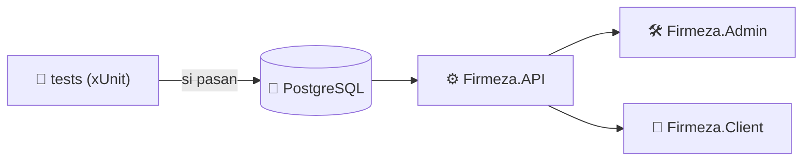

 

## ⚡ STACK TECNOLÓGICO

### 🔥 Núcleo

### 🖥️ Backend

### 🎨 Frontend

### 🧰 Herramientas

## 🚀 PROYECTO DESTACADO

### 📦 Firmeza — Plataforma de ventas full stack

Sistema para un negocio de **materiales de construcción y alquiler de vehículos**. El administrador gestiona productos, clientes y ventas, y los clientes compran en línea y reciben su comprobante por correo.

| Módulo | Qué hace | Tecnologías |
|:--|:--|:--|
| 🛠️ **Firmeza.Admin** | Panel administrativo: productos, clientes y ventas, carga masiva desde Excel, exportación a Excel/PDF y recibos en PDF | Razor Pages · EPPlus |
| ⚙️ **Firmeza.API** | API REST con autenticación, roles (Administrador y Cliente), DTOs y documentación interactiva | ASP.NET Core · Identity · JWT · AutoMapper · Swagger |
| 🛒 **Firmeza.Client** | SPA para clientes: registro, login, catálogo, carrito de compras y comprobante por correo | [React / Angular] · JWT |
| 🧪 **Firmeza.Tests** | Pruebas unitarias de la lógica de negocio, ejecutadas antes de cada despliegue | xUnit |
| 🐘 **Base de datos** | Almacenamiento compartido entre la API y el panel | PostgreSQL |

**✨ Lo más destacado**

- 🔐 Autenticación con **Identity + JWT** y un rol **Cliente** con políticas de autorización propias.
- 📥 **Carga masiva desde Excel**: lee datos desnormalizados, los normaliza en memoria, valida campos obligatorios y genera un log de errores.
- 🧾 **Recibos en PDF** al registrar cada venta, con datos del cliente, productos, totales e IVA.
- 📧 **Comprobante por correo** con SMTP de Gmail, diseñado para cambiarlo por un servidor empresarial sin tocar la lógica.
- 🐳 **Despliegue con un solo comando**: `docker compose up --build`. Primero corren las pruebas y, si alguna falla, no se levanta nada.

**🔄 Flujo de despliegue**

## 📊 ESTADÍSTICAS

 

  

## 📫 CONECTEMOS

 

*"Cada línea de código me acerca a mi meta."* 🚀

